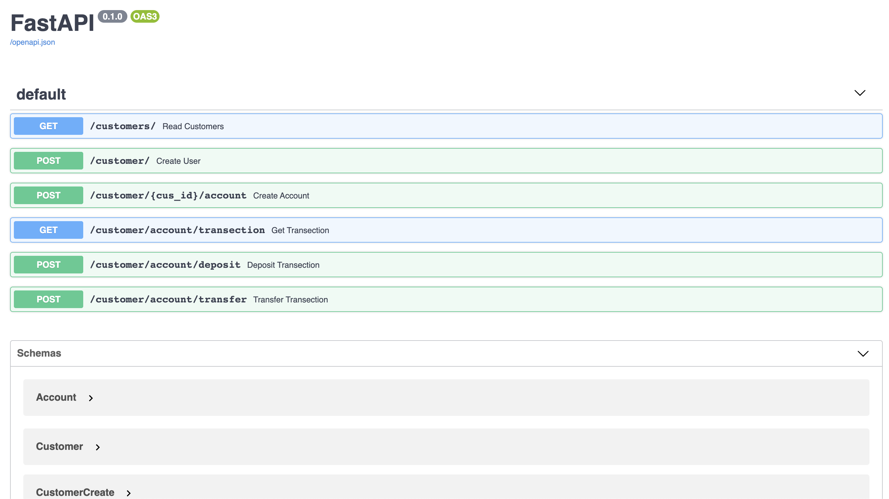
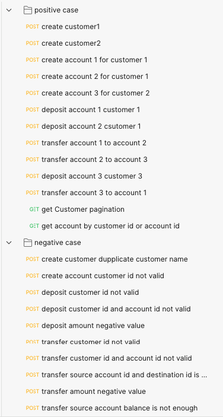
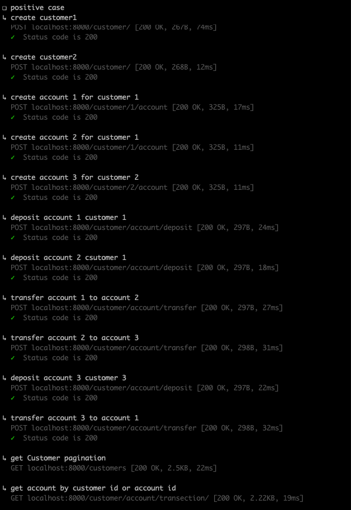
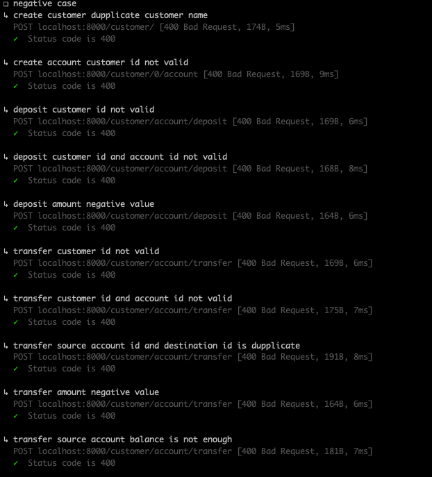
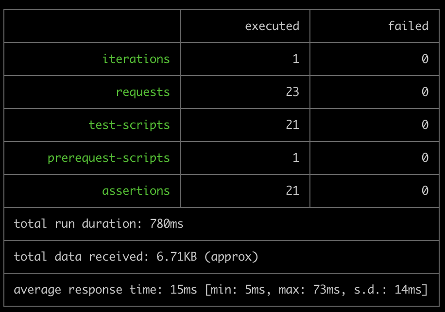

# fastapi
## Requirement library
- uvicorn==0.13.4
- fastapi==0.63.0
- SQLAlchemy==1.4.2

## Banking API

### Objective
Your assignment is to build an internal API for a fake financial institution using Python and FastAPI.

### Brief
While modern banks have evolved to serve a plethora of functions, at their core, banks must provide certain basic features. Today, your task is to build the basic HTTP API for one of those banks! Imagine you are designing a backend API for bank employees. It could ultimately be consumed by multiple frontends (web, iOS, Android etc).

### Tasks
* Implement assignment using:
> * Language: Python
> * Framework: FastAPI
> * Database: Any Database (SQL or NoSQL)
* There should be API routes that allow them to:
> * Create a new bank account for a customer, with an initial deposit amount. A single customer may have multiple bank accounts.
> * Transfer amounts between any two accounts, including those owned by different customers.
> * Retrieve balances for a given account.
> * Retrieve transfer history for a given account.
* Write tests for your business logic

### Feel free to pre-populate your customers with the following:
```json
[
  {
    "id": 1,
    "name": "Arisha Barron"
  },
  {
    "id": 2,
    "name": "Branden Gibson"
  },
  {
    "id": 3,
    "name": "Rhonda Church"
  },
  {
    "id": 4,
    "name": "Georgina Hazel"
  }
]
```
```
You are expected to design any other required models and routes for your API.
```

## start up project
```bash
# startup.sh
python3 -m venv bankenv && \
source bankenv/bin/activate && \
python -m pip install -r requirements.txt && \
python -m uvicorn bank_app.main:app
```

### Endpoint
```bash
http://0.0.0.0:8000           # api url
http://0.0.0.0:8000/docs      # swagger url
```

### swagger


## test senario
#### test by postman (newman)

## script test
```bash
# test_biz.sh
newman run senario_test.json -e env.json –delay-request 2000
```
## result test
#### positive case

#### negative case

#### Result test
